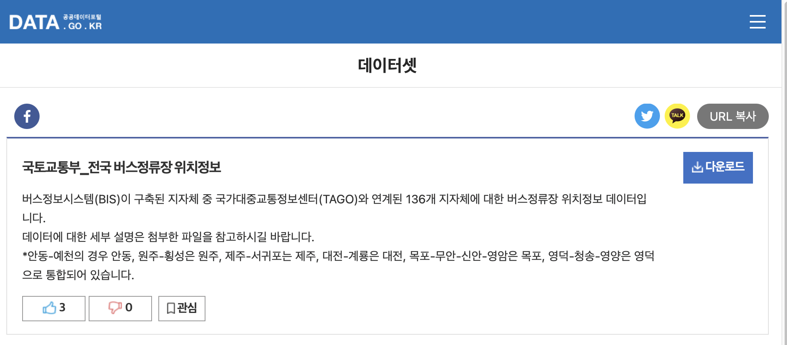
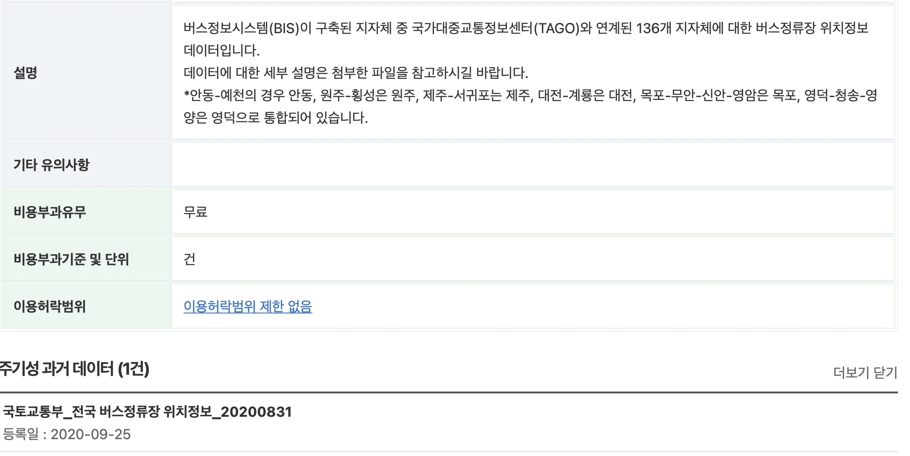

# 버스정류장 정보

최소 시간해상도: annual
DataID: 00d3a4539ae94cfa8756b158cae296fc
URL: https://www.data.go.kr/data/15067528/fileData.do
공간범위: 전국
담당자: Dongook ‍Son
데이터 상세: 버스정보시스템(BIS)이 구축된 지자체 중 국가대중교통정보센터(TAGO)와 연계된 136개 지자체에 대한 버스정류장 위치정보 데이터
데이터 제공처(기관/시스템): 국가대중교통정보센터(TAGO), 국토교통부
데이터 파일명: 국토교통부_전국 버스정류장 위치정보_20210916.zip
데이터 형식: csv
데이터 획득방법: Manual Download
마지막 업데이트: April 28, 2022 2:14 PM
시간범위: 2020-
원천데이터 관련 정보: https://www.notion.so/2007141c531f4b759cba52d6f44c5b3f
종류: 이동수단
최소 공간해상도: point
최종 선정: No
최종 수정자: Dongook ‍Son

## 현재 원천 데이터 변수 정의서

| 변수명 | 변수타입 | 변수 설명 | 데이터 샘플 |
| --- | --- | --- | --- |
| NODE_ID | STRING | 버스 정류소 고유 ID | TSB252000435 |
| NODE_NM | STRING | 정류소 명칭 | 송림2리경로당 |
| ADMIN_NM | STRING | 시군구 이름 | 강릉시 |
| NODE_TP | STRING | 정류소 유형 | 1 |
| CENTER_YN | BOOLEAN | 중앙차로 여부(Y/N) | N |
| NODE_ENM | STRING | 노드 영문명 | Dongyangsimenteuipgu |
| GPS_LONG | NUMBER | GPS 경도 | 128.794026 |
| GPS_LATI | NUMBER | GPS 위도 | 37.852718 |
| COLLECTD_TIME | DATETIME | 정보수집일시 | 2020-09-24 04:00:04 |
| CITY_CD | STRING | 도시코드 | 252 |
| CITY_NAME | STRING | 도시명 | 강릉시 |

## 현재 원천 데이터 획득 및 전처리 과정

### 현재 데이터 소개

버스 정류소 근처에서 대기 오염 물질이 더 많이 관측된다(**근거 필요**). 따라서 어떤 지점(좌표)의 대기 오염 정도를 파악하거나 추정할 때 근방(일정 반경 이내)의 버스 정류소 수, 각 버스 정류소를 거치는 노선 수 등 정보가 필요하다. 따라서 해당 데이터를 획득해야한다.

### 현재 원천 데이터 획득 방법

공공데이터포털에서 국토교통부 전국 버스정류장 위치정보를 획득할 수 있다. 해당 데이터는 버스정보시스템(BIS)이 구축된 지자체 중 국가대중교통정보센터(TAGO)와 연계된 136개 지자체에 대한 버스정류장 위치정보 데이터다.

현재 데이터는 2020년도, 2021년도 기준 두 개의 시점에 대해 있는데, 2021년에는 2020년의 칼럼을 바탕으로 추가적인 칼럼들이 생겼다. 따라서 해당 문서에서는 2020년 기준 테이블 형식을 기준으로한다. 

### 과거 원천 데이터와의 차이점

이전에는 KTDB에서 Shape 파일을 직접 다운로드하였다. 그리고 모두 ArcGIS 에서 전처리를 수작업으로 해야했었다. 그러나 공공데이터 포털에서 해당 데이터가 공개되면서 규격이 관리되기 때문에 이를 더 쉽게 관리할 수 있게 되었다.

 매년 업데이트되는 자료는 아래 사진과 같이 주기성 과거 데이터로 버전이 유지된다.

### 정제 방법 및 소스코드

위의 원천 데이터 변수 정의서에서 알 수 있듯 좌표 데이터는 위도와 경도가 각각 숫자형 자료로 제공된다. PostGIS 데이터베이스에 저장하기 위해서 해당 정보를 `POINT(GPS_LONG, GPS_LAT)`의 점 형태로 변환하여  `geometry`에 저장한다. `year` 칼럼은 정보수집일시의 연도를 바탕으로 가져오면 된다. 

## 저희 데이터 베이스에 들어갈 인풋 변수 정의서

| 변수명 | 변수타입 |
| --- | --- |
| id | STRING |
| ko_nm | STRING |
| type | STRING |
| is_center | BOOLEAN |
| name | STRING |
| geometry | GEOMETRY |
| year | NUMBER |
| record_time | DATETIME |
| city_cd | STRING |
| city_nm | STRING |